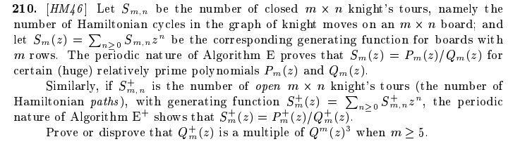

# Width-5 counterexample to a knight's-tour denominator conjecture

A reproducible, computer-assisted **disproof** of a conjecture about knight's-tour
generating functions, with a concrete counterexample at board width **m = 5**, assisted primarily by GPT-5.5 Pro.

## The problem


For the knight's graph on an `m x n` board, let `S_{m,n}` count **closed** tours
(Hamiltonian cycles) and `S^+_{m,n}` count **open** tours (Hamiltonian paths). For
fixed `m` these are rational generating functions in `z` (the variable marking the
number of columns `n`):

```
S_m(z)   = sum_{n>=0} S_{m,n}   z^n = P_m(z)   / Q_m(z),
S_m^+(z) = sum_{n>=0} S^+_{m,n} z^n = P_m^+(z) / Q_m^+(z).
```

> **Exercise 210** (Donald E. Knuth, [*The Art of Computer Programming, Volume 4, Fascicle 8A*](https://www-cs-faculty.stanford.edu/~knuth/fasc8a.pdf), rated HM46):
>
> *Prove or disprove that `Q_m^+(z)` is a multiple of `Q_m(z)^3` when `m >= 5`.*

**This repository disproves it.** At `m = 5`, `Q_5^+(z)` is **not** divisible by
`Q_5(z)^3`, so the universal statement is false.

## How the proof works

The polynomials `Q_5, Q_5^+` have degree in the thousands, so the proof never
computes them directly. Instead it works modulo the prime **101** and tracks a
single factor, `1 - 50z`:

1. **Transfer decomposition.** The open-tour transfer matrix, built with an
   auxiliary vertex `infinity` adjacent to every square, is block-triangular
   `B = [[T,X,Z],[0,U,Y],[0,0,W]]` ordered by the degree of `infinity` (0 -> 1 -> 2).
   `T` is the ordinary closed-tour transfer; after both `infinity` edges are placed,
   `W` contracts to another copy of `T`. Hence the reduced open denominator divides
   `det(I - zT) det(I - zU) det(I - zW_rel)` over the integers.
2. **Visible factor.** Over `F_101`, `1 - 50z` divides the reduced closed
   denominator `Q_5` (certified by an explicit `50`-eigenvector of the closed
   transfer, obtained as a polynomial in the transfer applied to the terminal
   vector and visible from the start state).
3. **Multiplicity bound.** The algebraic multiplicity of eigenvalue `50` in
   `T (+) U (+) W_rel` is **exactly 2** (`1 + 0 + 1`), certified by exact
   Wiedemann / Berlekamp-Massey nonsingularity certificates over
   `F_101[t]/(t^2 - 2) = F_(101^2)`, together with a border-matrix argument that
   makes the eigenvalue algebraically simple in the relevant block.
4. **Contradiction.** If `Q_5^3 | Q_5^+`, then `1 - 50z` would appear with
   multiplicity at least `3` in that determinant, contradicting the certified
   multiplicity `2`. Therefore `Q_5^+` is not a multiple of `Q_5^3`.

The full argument is in [PROOF.md](PROOF.md).

## Requirements

- a 64-bit little-endian machine;
- a C++17 compiler;
- GNU Make;
- OpenMP is optional and only parallelizes the Krylov verification; the code has a
  serial fallback. On Apple clang (which rejects `-fopenmp`), build with
  `make OMPFLAGS= all`.

No external mathematical library is used.

## Build

```sh
make all                 # or: make OMPFLAGS= all   (no OpenMP, e.g. Apple clang)
```

## Verify the claims

```sh
# 1. Independent counts: a Held-Karp enumeration on the 5x4 board, plus the first
#    closed/open transfer counts.
make sanity              # expect open 82, 864, 18784 for widths 4,5,6; closed 8 at width 6

# 2. Regenerate every state graph and reflection block from source and compare
#    byte-for-byte with the checked-in data (the generator is deterministic).
make regen-check

# 3. The visible modular factor 1-50z in the closed denominator.
make visible-check

# 4. The decisive step: exact rank / algebraic-multiplicity certificates. The
#    checker recomputes every Krylov moment from the matrices -- it does not trust
#    the stored moments -- and reruns Berlekamp-Massey.
OMP_NUM_THREADS=8 make rank-check
#    or run the six independent certificate checks in parallel:
JOBS=6 OMP_NUM_THREADS=1 scripts/verify_ranks_parallel.sh

# 5. Confirm every released file against its hash.
make hashes              # sha256sum -c SHA256SUMS
```

A pass on all five steps establishes that `1 - 50z` divides `Q_5` modulo 101, that
its multiplicity in the open-side transfer determinant is exactly two, and therefore
that `Q_5^+` is not a multiple of `Q_5^3`.

## Lean 4 verifier

This repository also includes a Lean 4 project that checks the formal
contradiction and independently verifies the checked-in binary certificate
files.  See [LEAN.md](LEAN.md) for details.

In brief, the Lean executable:

- checks SHA-256 hashes, binary magic/version fields, matrix dimensions, CSR
  structure, state-label tails, and FNV bindings;
- fully replays the visible-factor certificate by computing `r = g(A^2) beta`,
  checking the `76` and `50` eigenvector equations, and comparing against the
  restricted `Trel_plus` eigenvector;
- recomputes all `2N + 32` Wiedemann/Krylov moments from the actual sparse
  matrices for all six rank certificates when run in full mode;
- checks compact Padé/Bézout witnesses for all six rank certificates on every
  run, proving the stored moment sequence has no shorter scalar recurrence;
- reruns Berlekamp--Massey over the first `2N` stored moments and checks that
  the resulting full-degree connection polynomials match the stored
  coefficients;
- builds the formal Lean theorem
  `KnuthFasc8aEx210.WidthFiveCertificate.not_cubic_divisibility`, which proves
  over actual polynomial rings that the certified multiplicity facts contradict
  `Q_5(z)^3 | Q_5^+(z)` in `Q[z]`. The proof uses Mathlib's Gauss lemma to pass
  through `Z[z]` and then reduces coefficients into `(ZMod 101)[z]`;
- formalizes the bordered-matrix lemma used to establish algebraic simplicity:
  bordered injectivity implies `ker(H) = span(v)` and `v` is not in the range
  of `H`; using Mathlib's generalized-eigenspace theorem, Lean then proves the
  eigenvalue has characteristic-polynomial root multiplicity exactly one.
- embeds the `Trel_plus` bordered rank certificate and a deterministic
  checkpoint file, replays all 33 Krylov segments, composes their exact moment
  equalities, and proves in the kernel that `50` has root multiplicity one in
  the native `F_101` CSR characteristic polynomial.
- embeds the normal `Trel_minus` certificate through the same checkpointed
  pipeline and proves that `50` has root multiplicity zero in its native
  `F_101` CSR characteristic polynomial.

Lean also proves that a zero executable Padé mismatch count denotes the full
polynomial Bézout identity and, once the stored moments are identified with the
matrix's scalar Krylov moments, implies injectivity of the represented operator.

Type-check the Lean proof and run the quick certificate smoke check:

```sh
lake build
lake build knuth_cert_check
.lake/build/bin/knuth_cert_check
```

On a clean build, `lake build` also proves the embedded closed visible-factor
certificate.  The 4,107-step sparse Horner replay is split into four independent
checkpoint segments so Lake can check them concurrently; this expensive work is
cached in the resulting `.olean` files.

The default executable run checks only a short prefix and labels itself
`SMOKE`; it is not the full certificate replay.

Full Lean certificate-file verification:

```sh
.lake/build/bin/knuth_cert_check --full
```

The full Lean verifier is intentionally slower than the C++ checker because it
recomputes the large sparse Krylov streams in Lean.

The formal theorem and executable checker have an explicit trust boundary.
Lean's kernel checks the polynomial argument over `Q[z]`, Gauss's lemma over
`Z[z]`, reduction modulo 101, factor multiplicity, and the bordered-matrix
kernel/range lemma. The closed matrix, finish vector, polynomial, and bounded
Horner checkpoints are now embedded as closed Lean constants. Four
proof-shaped segment counters replay every Horner step, their mathematical
equalities compose to keep the final vector in the startup Krylov span, and a
final residual check proves `1-50X` in the actual normalized reduced closed
denominator. This conclusion no longer depends on running the `IO` executable.
Separately, that executable still replays all binary certificates and reports
success or failure. The bordered `Trel_plus` rank result is now closed from
embedded bytes into a concrete native-field root-multiplicity theorem. The
normal `Trel_minus` result is also closed; the four `U1`/`U2` rank certificates
are not yet closed into the final
`WidthFiveCertificate` proof term. Lean also descends the
checked block multiplicities to the raw `F_101` CSR operators, assembles the
full reflected block product (including both copies of `Trel`), proves that
non-50 singleton blocks add no visible factor, and formalizes the adjugate
argument that a normalized scalar transfer denominator divides
`det(I-XM)`. It also proves the closed-side visibility implication: an
observable `50`-eigenvector annihilated by the reversed denominator recurrence
forces `1-50X` to divide that denominator. The canonical reduced `RatFunc`
denominator is now proved, via formal power series and adjugate cancellation,
to supply the required eventual recurrence. What remains outside the final
kernel theorem is closing the remaining four rank-certificate checks from embedded bytes,
the concrete reflection/SCC decomposition and `Wrel ~= Trel` identification,
and the integer normalization that constructs the final
`WidthFiveCertificate`. Thus the repository is not yet a single end-to-end
kernel proof of the complete counterexample, but the closed visible side is now
concrete from checked-in bytes through the reduced denominator.

Expected full-graph SHA-256 values (also checked by `make regen-check`):

```text
f6f3c08995a607bf6217fcfe6d432a9c712b8962a0b785fe2ff03b56d808055e  data/T5.bin
847d20bc46ab8c060bfc00c49e26ab84e64d8bd4b0fe36a7915a9834be2d16ca  data/U5.bin
37c75a7aea19bd1dd885ec304c36ea165c02947d2575de829798dc03024ef5d7  data/W5.bin
```

## Verification status

This release has been independently audited and no discrepancies were found. The
checks below are reproducible from this repository:

- **Hashes and regeneration.** All `SHA256SUMS` entries verify, and `make regen-check`
  rebuilds the state graphs `T`, `U`, `W` and every reflection block byte-for-byte
  from source.
- **Counts vs. brute force.** A separate enumeration independent of the transfer code
  (Held-Karp on 5x4 via `bruteforce_5x4`, plus direct backtracking for wider boards)
  reproduces the open counts `82, 864, 18784, 622868` for widths 4-7 and the closed
  count `8` at width 6.
- **Visible factor.** `e^T A^k beta (mod 101)` reproduces the closed-tour counts,
  confirming that the eigenvalue `50` lives in the genuine closed denominator
  (`make visible-check`).
- **Multiplicity is two.** Each of the six nonsingularity / algebraic-simplicity
  facts was re-confirmed by an independent Wiedemann / Berlekamp-Massey computation
  over `F_(101^2)` with different random preconditioners, agreeing with the
  checked-in certificates (`make rank-check`).

## Regenerate the certificates

The checked-in certificates use seed `1`. Generation uses randomness only to *find*
the data; *verification* of the fixed data is deterministic and exact.

```sh
make certs-regenerate    # overwrites data/certs/*, then compare with sha256sum -c SHA256SUMS
```

## Repository layout

| Path | Purpose |
|---|---|
| `PROOF.md` | The mathematical argument, end to end |
| `src/transfer_generator.cpp` | Frontier (broken-profile) transfer generator for `T, U, W`; SCCs; terminal/coreachability checks |
| `src/extract_blocks.cpp` | Reflection decomposition into +/- blocks; exact `W_rel = T_rel` check; singleton checks |
| `src/sanity_counts.cpp` | Scalar closed/open counts, including terminal endpoint choices |
| `src/bruteforce_5x4.cpp` | Independent Held-Karp count on the 5x4 board |
| `src/closed_factor.cpp` | Constructs the visible `50`-eigenvector |
| `src/verify_visible.cpp` | Deterministic check that `1 - 50z` is visible in the closed scalar denominator |
| `src/wiedemann_ext.cpp` | Exact certificate generator over `F_(101^2)` |
| `src/pade_witness.cpp` | Generates compact Padé/Bézout minimality witnesses |
| `src/verify_rank_cert.cpp` | Independent exact certificate verifier |
| `LEAN.md`, `KnuthFasc8aEx210/` | Lean 4 theorem and certificate-file verifier |
| `lakefile.lean`, `lean-toolchain` | Pinned Lean/Lake project configuration |
| `data/`, `results/`, `SHA256SUMS` | Matrices, certificates, captured outputs, and hashes |

## Binary formats

All integer fields are little-endian.

- `KMC201` — sparse CSR matrix modulo 101, followed by canonical state labels.
- `KMV101` — eigenvector and nonzero pivot.
- `KMP101` — polynomial used for the visible factor.
- `KMW2CERT` — rank certificate header, Krylov moments, and BM connection polynomial.
- `KPB101W1` — Padé/Bézout witness bound to a `KMW2CERT` source hash.

`SHA256SUMS` covers every source, matrix, and certificate in the release.

## Reproducibility notes

The generator is fully deterministic -- no hash-table iteration order is allowed to
affect a saved transition list -- so `make regen-check` rebuilds every matrix
byte-for-byte from source. The certificate verifier reconstructs the random
preconditioners and probe vectors from a recorded seed, recomputes all `2N + 32`
moments from the sparse matrix, reruns Berlekamp-Massey, and only then compares
against the stored data, so a passing run does not depend on trusting any
precomputed file.
